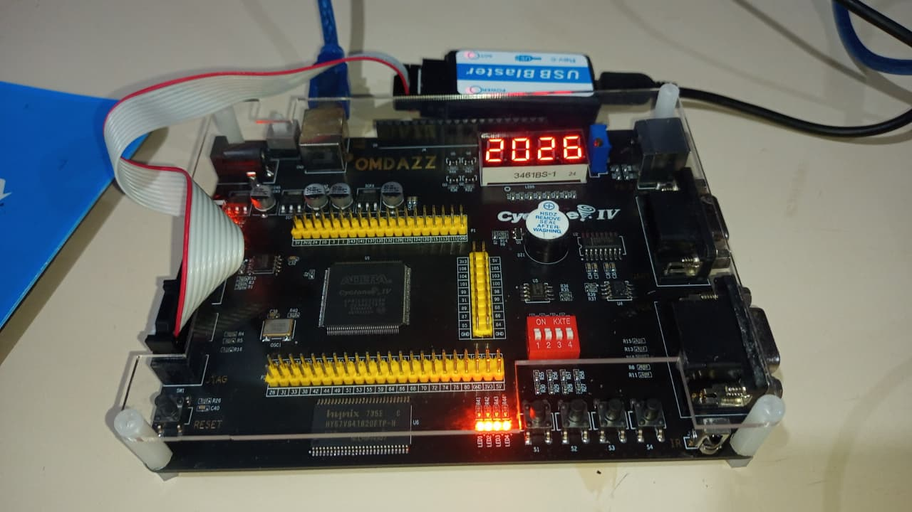
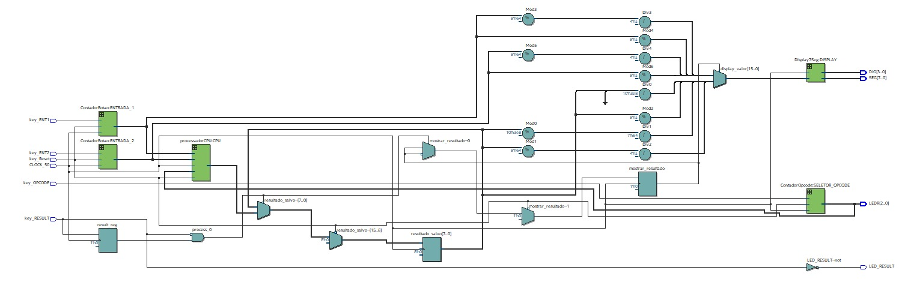
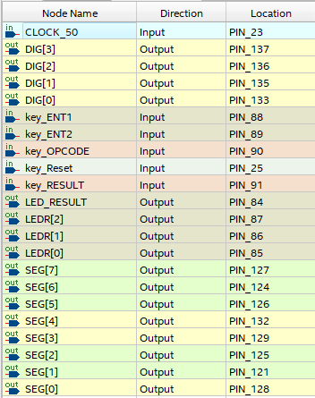

# Mini CPU

* Projeto para simular o funcionamento de CPU em VHDL com FPGA.
* Utilizando Registradores, ULA e Controle.

# FPGA Cyclone IV

# Diagrama do  Circuito (RtlViewer)

# Pinagem (Print)

# Pinagem (Tabela)
| Nome | Tipo | Pino |
| :--- | :---: | :---: |
| CLOCK_50 | Input | PIN_23 |
| DIG[3] | Output | PIN_137 |
| DIG[2] | Output | PIN_136 |
| DIG[1] | Output | PIN_135 |
| DIG[0] | Output | PIN_133 |
| key_ENT1 | Input | PIN_88 |
| key_ENT2 | Input | PIN_89 |
| key_OPCODE | Input | PIN_90 |
| key_Reset | Input | PIN_25 |
| key_RESULT | Input | PIN_91 |
| LED_RESULT | Output | PIN_84 |
| LEDR[2] | Output | PIN_87 |
| LEDR[1] | Output | PIN_86 |
| LEDR[0] | Output | PIN_85 |
| SEG[7] | Output | PIN_127 |
| SEG[6] | Output | PIN_124 |
| SEG[5] | Output | PIN_126 |
| SEG[4] | Output | PIN_132 |
| SEG[3] | Output | PIN_129 |
| SEG[2] | Output | PIN_125 |
| SEG[1] | Output | PIN_121 |
| SEG[0] | Output | PIN_128 |

